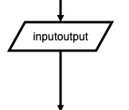

[](http://js.org)

# [flowchart.js](http://flowchart.js.org)

flowchart.js is a flowchart DSL and SVG render that runs in the browser and [terminal](https://github.com/francoislaberge/diagrams/#flowchart).

Nodes and connections are defined separately so that nodes can be reused and connections can be quickly changed.
Fine grain changes to node and connection style can also be made right in the DSL.

## Example

```flowchart
st=>start: Start:>http://www.google.com[blank]
e=>end:>http://www.google.com
op1=>operation: My Operation
sub1=>subroutine: My Subroutine
cond=>condition: Yes
or No?:>http://www.google.com
io=>inputoutput: catch something...
para=>parallel: parallel tasks

st->op1->cond
cond(yes)->io->e
cond(no)->para
para(path1, bottom)->sub1(right)->op1
para(path2, top)->op1
```


## Browser Usage

flowchart.js is on [CDNJS](https://cdnjs.com/libraries/flowchart), feel free to use it.

You will also need [Raphaël](http://www.raphaeljs.com/), which is also on [CDNJS](https://cdnjs.cloudflare.com/ajax/libs/raphael/2.3.0/raphael.min.js).

The demo html page is at [example/index.html](example/index.html).

## Node Syntax
`nodeName=>nodeType: nodeText[|flowstate][:>urlLink]`

Items in `[]` are optional.

_nodeName_ defines the nodes variable name within the flowchart document.

_nodeType_ defines what type the node is. See **Node Types** for more information.

_nodeText_ is the text that will be inserted into the node. Newlines are allowed and will be reflected in the rendered node text.

_flowstate_ is optional and uses the `|` operator that specifies extra styling for the node.

_urlLink_ is optional and uses the `:>` operator to specify the url to link to.

## Node Types
Defines the shape that the node will take.

### start
Used as the first node where flows start from.
Default text is `Start`.


```flowchart
st=>start: start
```

### end
Used as the last node where a flow ends.
Default text is `End`.


```flowchart
e=>end: end
```

### operation
Indicates that an operation needs to happen in the flow.


```flowchart
op1=>operation: operation
```

### inputoutput
Indicates that IO happens in a flow.



```flowchart
io=>inputoutput: inputoutput
```

### subroutine
Indicates that a subroutine happens in the flow and that there should be another flowchart that documents this subroutine.


```flowchart
sub1=>subroutine: subroutine
```

### condition
Allows for a conditional or logical statement to direct the flow into one of two paths.


```flowchart
cond=>condition: condition
Yes or No?
```

### parallel
Allows for multiple flows to happen simultaneously.


```flowchart
para=>parallel: parallel
```

## Connections
Connections are defined in their own section below the node definitions.
The `->` operator specifies a connection from one node to another like `nodeVar1->nodeVar2->nodeVar3`.

Not all nodes need to be specified in one string and can be separaged like so

```flowchart
nodeVar1->nodeVar2
nodeVar2->nodeVar3
```

Connection syntax is as follows:

`<node variable name>[(<specification1>[, <specification2])]-><node variable name>[[(<specification1>[, <specification2])]-><node variable name>]`

Items in `[]` are optional.


